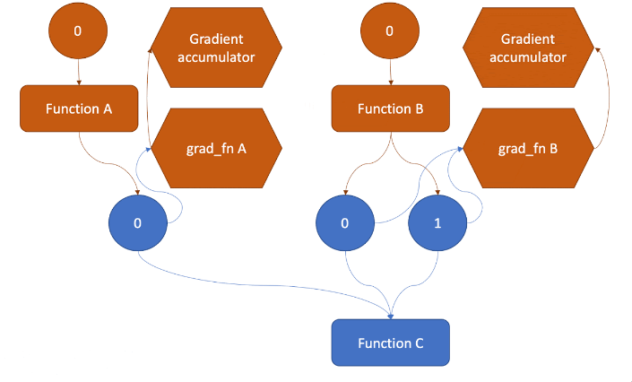
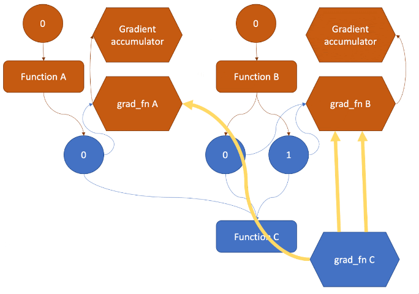

# TensorLib

- [x] Implement computational graph.
- [x] Implement backprop by extending computational graph.
- [x] Fix memory leakage due to circular dependency (sharedptr).
- [x] CPU implementation for most tensor functions.
- [ ] GPU implementation for most tensor functions.
- [ ] Simple neural network implementation.

## Running Instructions

### Python

First run

```bash
sh build.sh
```

which creates a build directory with the .so file, then set the PythonPath:

```bash
export PYTHONPATH=$(pwd)/build:$PYTHONPATH
```

Afterwards, you can use tensorlib by `import tensorlib`, see [example.py](example/example.py).

### C++(Cuda)

For any c++ file, simply link the nessesary libraries:

```sh
nvcc example/example.cpp -Iinclude/ -Lbuild/ -ltensorlib_cpp -lopenblas -lcudart -lcublas -o example/example
```

and then run:

```sh
./example/example
```

see [example.cpp](example/example.cpp) for a use case.

## Tensor Operations

- `Tensor`: Base class for all tensors.
- `AutoGrad`: Class for automatic differentiation.

### Supported Operations

All operations are supported for both CPU and GPU tensors.

- `add`: Element-wise addition, `a + b`.
- `sub`: Element-wise subtraction, `a - b`.
- `mul`: Element-wise multiplication, `a * b`.
- `div`: Element-wise division, `a / b`.

All these operations support broadcasting, that is, they can be applied to tensors of different shapes, as long as the shapes are compatible (if one of the dimensions is 1, the tensor is broadcasted along that dimension).

- `matmul`: Matrix multiplication, `a @ b` or `matmul(a,b)`.
- `transpose`: Transpose of a tensor, `a.T` or `transpose(a)`.

These operations requires the tensors to be of compatible shapes (i.e., the number of columns of the first tensor should be equal to the number of rows of the second tensor), and they should be either 2 or 3-tensors.

- `sum`: Sum of the elements of a tensor along a given axis, `sum(a, axis)`.
- `mean`: Mean of the elements of a tensor along a given axis, `mean(a, axis)`.
- `max`: Maximum of the elements of a tensor along a given axis, `max(a, axis)`.
- `min`: Minimum of the elements of a tensor along a given axis, `min(a, axis)`.

These operations shrink the tensor along the given axis.

- `log`: Element-wise natural logarithm, `log(a)`.
- `exp`: Element-wise exponential function, `exp(a)`.
- `relu`: ReLU activation function, `relu(a)`.

- `select_idx`: Select a subset of elements from a tensor, `a[index]` or `select_idx(a, index)`.
- `reshape`: Reshape a tensor to a given shape, `reshape(a, shape)`.
- `flatten`: Flatten a tensor, `flatten(a)`.
- `broadcast_to`: Broadcast a tensor to a given shape, `broadcast_to(a, shape)`.

## How it works

The project is structured similar to how PyTorch autograd works as described in the [PyTorch documentation](https://pytorch.org/blog/computational-graphs-constructed-in-pytorch/).

While constructing the computational graph, the user can specify the gradient of the output tensor with respect to the input tensor. For tensors that are not results of operations, they are the leaf nodes of the computational graph. (The figures below are taken from the PyTorch documentation.)



As the user does operations on the tensors, the computational graph is constructed. The new grad_fn, which represents the gradient function, is connected to the input tensors.



When the user calls the `backward` function, the gradient of the output tensor with respect to the input tensor is computed using backpropagation. The gradients are then stored in the input gradients of the tensors. If the tensor for which the user called `backward` on is not a scalar, the user can manually specify the gradient of the output tensor with respect to the input tensor.

For example, we can specify the gradient of the output tensor with respect to the input tensor as follows:

```python
grad_output = tensorlib.ones(output.shape)
output.backward(grad_output)
```

similar to how it is done in PyTorch.

The computational graph is then used to compute the gradient of the output tensor with respect to the input tensor using backpropagation and the chain rule.

## Project Structure

- `include/`: Header files.
- `src/`: Source files.
- `example/`: Example files.
- `build/`: Build directory (created by `build.sh`).
- `build.sh`: Build script.

## Dependencies

- [CMake](https://cmake.org/), for building the project.
- [Python](https://www.python.org/), for running the Python code.
- [OpenMP](https://www.openmp.org/), for parallelizing the CPU code.
- [OpenBLAS](https://www.openblas.net/), for CPU implementation of many matrix operations.
- [CUDA](https://developer.nvidia.com/cuda-downloads), for GPU implementation of many operations.
- [CuBLAS](https://developer.nvidia.com/cublas), for GPU implementation of many matrix operations.
